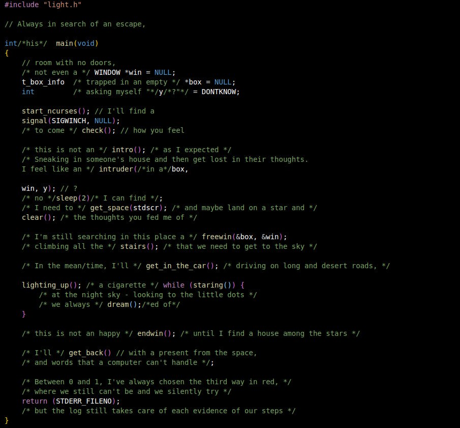

# dontreadme

sometimes I have to put my mind at ease.

write code without sense of utility

let | line by line | flow functions - which, in this  
{  
&emsp;case ',':  is better to use /\*each one\*/ just once.  
&emsp;&emsp;break;  
}



## Dependencies

- gcc
- cmake
- libncurses5-dev
- locales
- docker (*optional*)

## Usage

### Standard &emsp; [ no Docker ] [ debian-based Linux ]

1. Install dependencies

```
sudo apt-get update
sudo apt-get upgrade
sudo apt-get install libncursesw5-dev make gcc locales
```

2. Clone repository

```
git clone https://github.com/stenterello/there_is_a_light_that_never_goes_STDOUT_FILENO.git
```

3. Put yourself inside 'light' directory and compile
```
cd there_is_a_light_that_never_goes_STDOUT_FILENO/light
cmake -B build .
cd build
make
./light
```

### Docker &emsp; [ on debian-based Linux ]

1. [Install dependencies](https://docs.docker.com/engine/install/ubuntu/)

2. Clone repository
```
git clone https://github.com/stenterello/there_is_a_light_that_never_goes_STDOUT_FILENO.git
```
3. Put yourself in project root directory
```
cd there_is_a_light_that_never_goes_STDOUT_FILENO
```
4. Build Docker image
```
sudo docker build -t example:1 .
```
5. Run docker container with memory allocated for interactive terminal
```
sudo docker run --rm -it example:1
```

### Notes
Entire text (in italian) can be found in text/all.